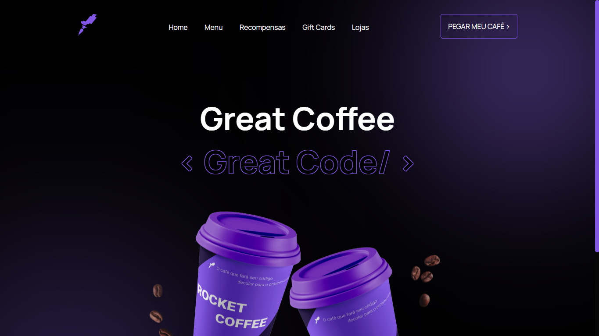

<h1 align="center"> Projeto Desafio: RocketCoffee da Rocketseat ☕ </h1>

 <h2 align="center">⸻⸻ Desafio do curso Discover da Rocketseat. ⸻⸻    Resultado: https://sriinfinity.github.io/RocketCoffee-main/ </h2>
 

<h1 align="center">
 
 TECNOLOGIAS ULTILIZADAS
 
 ⸻
 
 ⸻

⸻

⸻
</h1>

<h6 align="center"> <b>Codado por srINFINITY<b> </h6>
